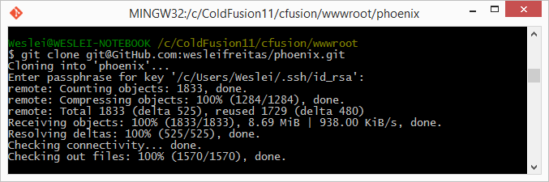
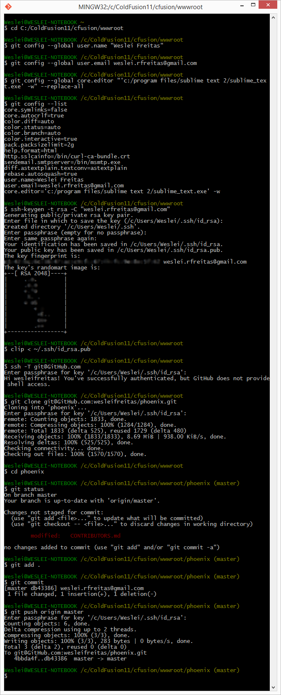

# Phoenix - Inicialização

Para iniciar sua colaboração siga os passos a seguir.

1. Instale o [Adobe ColdFusion](http://www.adobe.com/cfusion/tdrc/index.cfm?product=coldfusion&loc=pt_br). [Instruções de instalação não disponível no momento]
2. Instale o [Sublime Text 2](http://www.sublimetext.com/2)
3. Crie um usuário [GitHub](https://GitHub.com) caso não possua.
4. Envie um e-mail para weslei.rfreitas@gmail.com com o assunto “[PHOENIX] GitHub” e no corpo do e-mail coloque seu usuário GitHub que será adicionado ao Phoenix Project.
5. O sistema de controle de versão utilizado é o GIT, caso não esteja familiarizado, é recomendado ler o book [Pro Git book[pt-BR]](http://git-scm.com/book/pt-br/v1), veja a seguir os capítulos essenciais:
 
  >Capítulo 1. Primeiros passos (Completo)

  >Capítulo 2. Git Essencial (Completo)
  
  >Capítulo 3. Ramificação (Branching) no Git (Completo)
  
  >Capítulo 4. Git no Servidor
  
  >Capítulo 4.3. Git no Servidor - Gerando Sua Chave Pública SSH
  
  >Capítulo 4.10 Git no Servidor - Git Hospedado
  
  >Capítulo 5. Git Distribuído
  
  >Capítulo 5.1 Fluxos de Trabalho Distribuídos
  
  >Capítulo 5.2 Contribuindo Para Um Projeto
  
  >Capítulo 6.2 Ferramentas do Git - Área de Seleção Interativa
  
  >Capítulo 6.3 Ferramentas do Git - Fazendo Stash

6. Instale o [Git](http://git-scm.com/downloads) caso não possua.
7. Aguarde uma confirmação de e-mail (passo 4) e prossiga com o item a seguir (Configuração inicial).

## Configuração inicial

* Execute o Git Bash
* Navegue até a pasta ColdFusion11/cfusion/wwwroot:


### Sua Identidade

A primeira coisa que você deve fazer quando instalar o Git é definir o seu nome de usuário e endereço de e-mail. Isso é importante porque todos os commits no Git utilizam essas informações, e está imutavelmente anexado nos commits que você realiza:

```bash
$ git config --global user.name "Weslei Freitas"
$ git config --global user.email weslei.rfreitas@gmail.com   
```

### Seu Editor

Agora que sua identidade está configurada, você pode configurar o editor de texto padrão que será utilizado quando o Git precisar que você digite uma mensagem. Por padrão, Git usa o editor padrão do sistema, que é geralmente Vi ou Vim. Como sugestão será utilizado o Sublime Text 2:

```bash
$ git config --global core.editor "'c:/program files/sublime text 2/sublime_text.exe' -w" --replace-all
```

### Verificando Sua Configurações

É possível verificar suas configurações com o comando a seguir.

```bash
$ git config --list
```

### Gerando Sua Chave Pública SSH 

Para utilizar e compartilhar códigos no GitHub será necessário uma chave SSH.	Neste ponto você deverá ter um conta no GitHub.
No Git Bash digite:

```bash
ssh-keygen -t rsa -C "seu_email@email.com"
```

Informe no comando seu e-mail cadastrado no GitHub. Dê **Enter** na próxima pergunta (sobre o arquivo a ser criado – deixe o padrão).
A próxima pergunta irá pedir uma senha (passphrase). Invente uma senha e a informe. Será solicitado uma confirmação. Digite a senha novamente e tecle **Enter**.

Agora digite:

```bash
clip < ~/.ssh/id_rsa.pub
```
Este comando irá copiar sua chave pública.

Agora acesse sua conta GitHub, vá em **Configurações** -> **SSH Keys**, clique em **Add SSH key**;
Defina um **Título** e cole sua chave pública no campo **Key**.

Para se certificar de que tudo está funcionando digite:

```bash
ssh -T git@GitHub.com
```

Caso apareça o aviso abaixo, não se preocupe.

> The authenticity of host 'GitHub.com (207.97.227.239)' can't be established.

> RSA key fingerprint is 16:27:ac:a5:76:28:2d:36:63:1b:56:4d:eb:df:a6:48.

> Are you sure you want to continue connecting (yes/no)?

Digite *yes* , depois tecle **Enter**.
> Hi [username]! You've successfully authenticated, but GitHub does not

> provide shell access.

Se esse é seu nome de usuário, você configurou com êxito a sua chave SSH! Não se preocupe com o "acesso shell".


### Clone {phoenix} e {px_sampler}

No Git Bash execute:

```bash
git clone git@GitHub.com:wesleifreitas/phoenix.git
```

Irá solicitar sua senha SSH para verificar permissões.



Agora o projeto phoenix foi criado no diretório *wwwroot (ColdFusion)*.
Abra o **Sublime Text 2** e adicione a pasta *phoenix*.


O projeto phoenix está configurado em sua máquina.
Agora repita os procedimentos e clone o projeto de exemplo **px_sampler**.

```bash
git clone git@GitHub.com:wesleifreitas/px_sampler.git
```


Neste momento o diretório wwwroot (ColdFusion) deve conter as pasta *phoenix* e *px_sampler*.
Adicione a pasta px_sampler no Sublime Text 2.

### Primeiro commit no projeto Phoenix

Abra o arquivo *phoenix/***CONTRIBUTORS.md** no **Sublime Text 2**, e coloque sua identificação [nome - e-mail] conforme figura a seguir.


Após salvar a alteração no arquivo vá ao Git Bash e execute os comandos:

```bash
cd phoenix  
```
Comando para entrar na pasta phoenix (projeto clonado)

```bash
git status
```
Verificar alterações

```bash
git add .
```
Adicionar arquivo na área de seleção

```bash
git commit
```
Operação commit (Git irá solicitar mensagem de commit no **Sublime Text 2**, por ora coloque somente **seu e-mail**). 
Para concluir a operação salve e feche a aba **COMMIT_EDITMSG** (Ao fechar esta aba significa que seu commit **local** foi finalizado).


Para publicar seu commit digite:

```bash
git push origin master
```
Git enviará suas modificações para o servidor remoto (GitHub) no branch **master**. Para outros colaboradores visualizarem suas alterações, eles deverão executar o comando “git pull origin master”.

A figura abaixo mostra a sequência de operações realizadas acima no **Git**.



**Importante:** Antes de realizar testes e executar qualquer mudança termine de ler todo o Guia.
