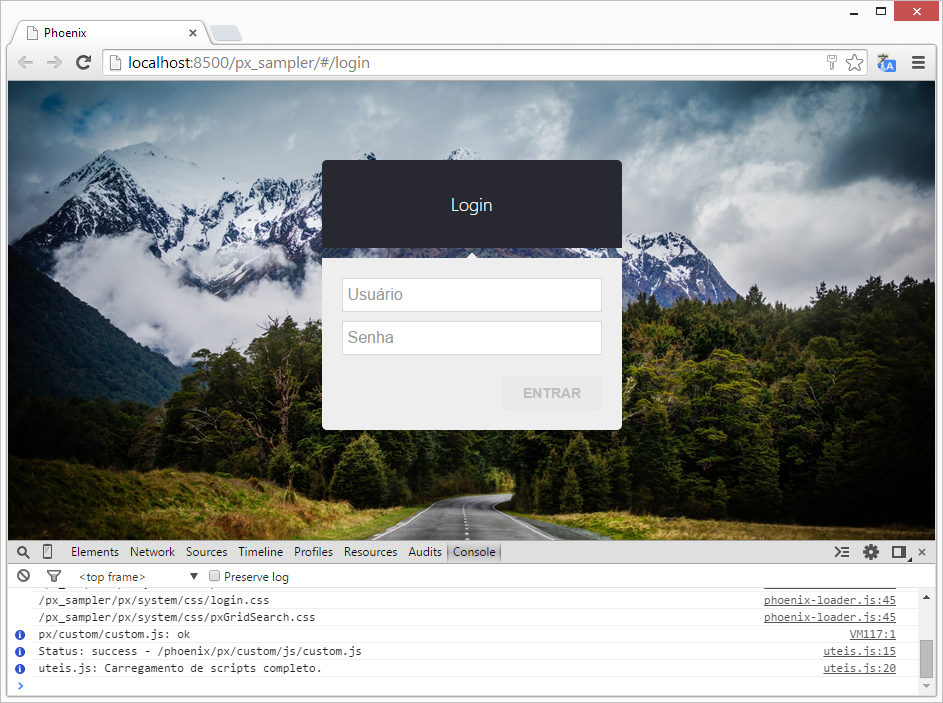
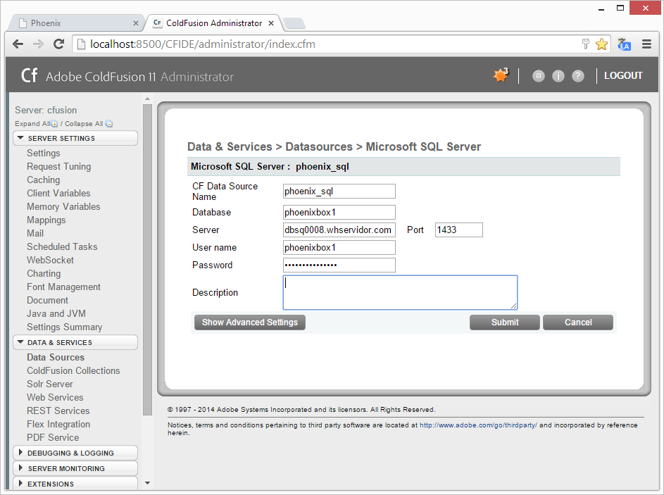

# Phoenix Sampler

Para acessar o projeto de exemplo baseado na phoenix acesse no navegador o seguinte endereço: [http://localhost:8500/px_sampler](http://localhost:8500/px_sampler)

Antes de realizar o login no sistema, o **DSN (ColdFusion)** deve ser configurado, então acesse: 
[http://localhost:8500/CFIDE/administrator](http://localhost:8500/CFIDE/administrator); Na seção **DATA & SERVICES** -> **Data Sources**, crie uma nova conexão.

Parâmetro | Valor
------------ | -------------
CF Data Source Name | phoenix_sql
Database | phoenixbox1
Server | dbsq0008.whservidor.com | Port: 1433
User name | phoenixbox1
Password | *Solicitar senha enviando um email para weslei.rfreitas@gmail.com, com o assunto* **[PHOENIX] DSN**

Com a conexão definida, vá endereço [http://localhost:8500/px_sampler](http://localhost:8500/px_sampler) e realize o login:

Campo | Valor
------------ | -------------
Usuário | phoenix
Senha | atopng
